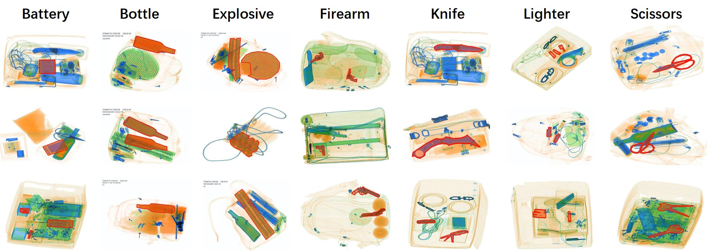

# Xray-PI Dataset

The Xray-PI dataset is constructed by Laboratory of Pattern Analysis and Intelligent System , East China Normal University.

## Introduction

Our prohibited item dataset named Xray-PI contains 2409 positive images, in which some have one prohibited item while the others have more prohibited items, and 10000 normal images without prohibited items. All the images in Xray-PI are collected or captured from color X-ray scanners.

In our dataset, we define seven different categories, namely, battery, bottle, explosive, firearm, knife, scissors and lighter. The following table shows the specific numbers of each category in detail. We provide the boundary information for all positive images to help generate pixel-wise masks. 

**Note: Some images are collect from existing dataset such as SIXray, we annotated them again in the form of segmentation.**

<table class="tg">
  <tr>
    <th class="tg-c3ow" colspan="7">Positive (2409)</th>
  </tr>
  <tr>
    <td class="tg-c3ow">Battery</td>
    <td class="tg-c3ow">Bottle</td>
    <td class="tg-c3ow">Explosive</td>
    <td class="tg-c3ow">Firearm</td>
    <td class="tg-c3ow">Knife</td>
    <td class="tg-c3ow">Lighter</td>
    <td class="tg-c3ow">Scissors</td>
  </tr>
  <tr>
    <td class="tg-c3ow">1488</td>
    <td class="tg-c3ow">120</td>
    <td class="tg-c3ow">90</td>
    <td class="tg-c3ow">69</td>
    <td class="tg-c3ow">1377</td>
    <td class="tg-c3ow">1491</td>
    <td class="tg-c3ow">1043</td>
  </tr>
</table>

Different from GDXray or SIXray datasets, our dataset contains some categories such as explosive and bottle which are not included in other datasets. And the intra-class variance of each category is much bigger, e.g. the plastic lighter and iron-shell lighter in the category of lighter.

## Download 

- Download the entire dataset from here (coming soon)
- Download the positive part of our dataset from [OneDrive](https://1drv.ms/u/s!Avcw2GQq4yx0tnuWcvH-DnDk4MJZ?e=XGy9N2) or  [Baidu/Extract Code:nx1b](https://pan.baidu.com/s/1AT-EHIde7a_evXfknhpGVQ)  
- To obtain the decompression password, please contact us (email: 51184506047@stu.ecnu.edu.cn)

## License

- The images and the corresponding annotation results can only be used for ACADEMIC PURPOSES. NO COMERCIAL USE is allowed

